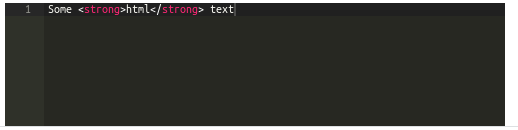
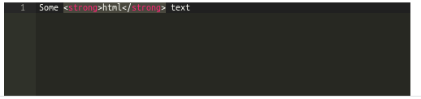

# React-Admin AceEditor

[](https://www.npmjs.com/package/@dslab/ra-ace-editor)
[](https://github.com/smartcommunitylab/react-admin-packages/blob/master/packages/ra-ace-editor/README.md)
[](https://github.com/smartcommunitylab/react-admin-packages/graphs/commit-activity)
[](https://github.com/smartcommunitylab/react-admin-packages/blob/master/LICENSE)

React AceEditor input + field for React-Admin.

Add support for Ace Editor [https://ace.c9.io/] via https://github.com/securingsincity/react-ace

Exports:

-   **AceEditorField** for visualization
-   **AceEditorInput** for editing

## Install

```sh
yarn install @dslab/ra-ace-editor
```

## Usage

Import the components from the library as needed.

#### AceEditorField

To use the field in a _show_ view include the component

```javascript
<AceEditorField mode="html" source="body" theme="monokai" />
```



#### AceEditorInput

To use the input in an _edit/create_ form include the component

```javascript
<AceEditorInput mode="html" source="body" theme="monokai" />
```



## Author

**SmartCommunityLab**

-   Website: http://www.smartcommunitylab.it/
-   Github: [@smartcommunitylab](https://github.com/smartcommunitylab)

## Show your support

Give a ⭐️ if this project helped you!

## License

Copyright © 2023 [SmartCommunityLab](https://github.com/smartcommunitylab).<br />
This project is [MIT](https://github.com/smartcommunitylab/react-admin-packages/blob/master/LICENSE) licensed.
