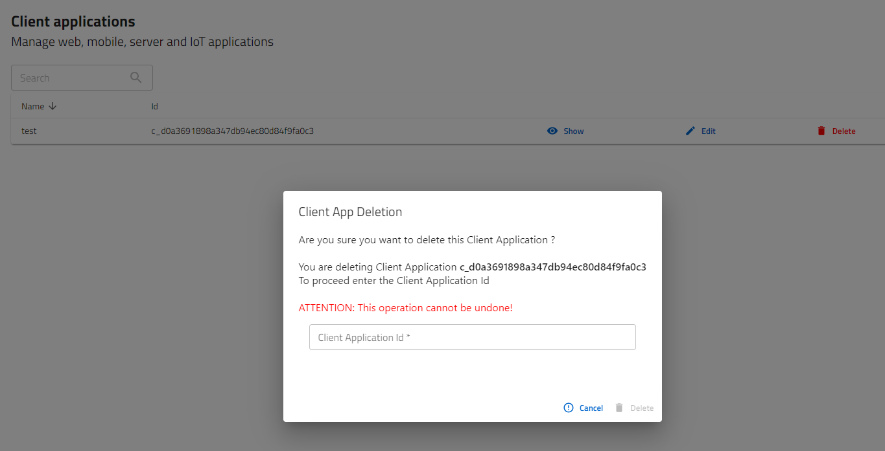

# React-Admin Json Schema Input

[](https://www.npmjs.com/package/@dslab/ra-jsonschema-input)
[](https://github.com/smartcommunitylab/react-admin-packages/blob/master/packages/ra-jsonschema-input/README.md)
[](https://github.com/smartcommunitylab/react-admin-packages/graphs/commit-activity)
[](https://github.com/smartcommunitylab/react-admin-packages/blob/master/LICENSE)

Delete with confirm field for React-Admin, to render a nested field in the record to match as confirmation before performing deletion.
Supports validation, required flags and the most common field types. Uses MUIv5 as ui library.

Also supports OOB i18n via react-admin providers and translation messages.

## Install

```sh
yarn install @dslab/ra-delete-confirm
```

## Usage

To use in an edit context, where the record is available, include the component as any other button in list or toolbar actions.

The list of required parameters  are

```
 title="Item title"
 property="Property in record to perform deletion on"
 rootId='name of parent resource'
 resourceName="Item name"
 registeredResource="resource id registered in Apps.tsx file"
 redirectUrl="url to redirect after delete"
 ```

The list could be implemented like the following.

```javascript
import { DeleteButtonDialog } from '@dslab/ra-delete-confirm';
import {
    List,
    useListContext,
    SearchInput,
    Datagrid,
    TextField,
    TopToolbar,
    CreateButton,
    ShowButton,
    useRecordContext,
    Button,
    EditButton,
} from 'react-admin';
import { useParams } from 'react-router-dom';
import { Box, Typography } from '@mui/material';

export const AppList = () => {
    const params = useParams();
    const options = { meta: { realmId: params.realmId } };
    useListContext<any>();
    return (
        <>
            <br />
            <Typography variant="h5" sx={{ mt: 1 }}>
                Client applications
            </Typography>
            <Typography variant="h6">
                Manage web, mobile, server and IoT applications
            </Typography>
            <List
                empty={<Empty />}
                actions={<AppListActions />}
                queryOptions={options}
                filters={RealmFilters}
                sort={{ field: 'name', order: 'DESC' }}
            >
                <Datagrid bulkActionButtons={false}>
                    <TextField source="name" />
                    <TextField source="id" />
                    <ShowAppButton />
                    <EditAppButton />
                    <DeleteButtonDialog
                        rootId={params.realmId}
                        property="id"
                        title="Client App Deletion"
                        resourceName="Client Application"
                        registeredResource="apps"
                        redirectUrl={`/apps/r/${params.realmId}`}
                    />
                    <ExportAppButton />
                </Datagrid>
            </List>
        </>
    );
};

```

Screenshot for the resulting form




## Author

**SmartCommunityLab**

-   Website: http://www.smartcommunitylab.it/
-   Github: [@smartcommunitylab](https://github.com/smartcommunitylab)

## Show your support

Give a ⭐️ if this project helped you!

## License

Copyright © 2023 [SmartCommunityLab](https://github.com/smartcommunitylab).<br />
This project is [MIT](https://github.com/smartcommunitylab/react-admin-packages/blob/master/LICENSE) licensed.
