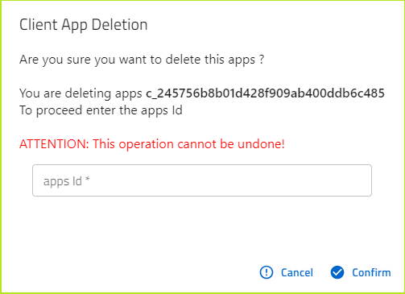

# React-Admin `Delete with confirm`` dialog

[](https://www.npmjs.com/package/@dslab/ra-delete-confirm)
[](https://github.com/smartcommunitylab/react-admin-packages/blob/master/packages/ra-jsonschema-input/README.md)
[](https://github.com/smartcommunitylab/react-admin-packages/graphs/commit-activity)
[](https://github.com/smartcommunitylab/react-admin-packages/blob/master/LICENSE)

Delete with confirm dialog for React-Admin, to render a nested field in the record to match as confirmation before performing deletion.
Supports validation on user input match against resource id. Uses MUIv5 as ui library.

## Install

```sh
yarn install @dslab/ra-delete-confirm
```

## Usage

To use in an show/edit context, where the record is available, include the component as any other button in list or toolbar actions.

The list of optional parameters are

```
 confirmTitle="Resource title"
 mutationOptions="optional API query parameters"
 redirect="url to redirect after deletion"
 ```

The list could be implemented like the following.

```javascript
export const AppList = () => {
    const params = useParams();
    const options = { meta: { realmId: params.realmId } };
    useListContext<any>();
    return (
        <>
            <List>
                <Datagrid bulkActionButtons={false}>
                    <DeleteButtonDialog
                        mutationOptions={options}
                        confirmTitle="Resource Deletion"
                        redirect={`/apps/r/${params.id}`}
                    />
                </Datagrid>
            </List>
        </>
    );
};

```

Screenshot for the resulting form




## Author

**SmartCommunityLab**

-   Website: http://www.smartcommunitylab.it/
-   Github: [@smartcommunitylab](https://github.com/smartcommunitylab)

## Show your support

Give a ⭐️ if this project helped you!

## License

Copyright © 2023 [SmartCommunityLab](https://github.com/smartcommunitylab).<br />
This project is [MIT](https://github.com/smartcommunitylab/react-admin-packages/blob/master/LICENSE) licensed.
