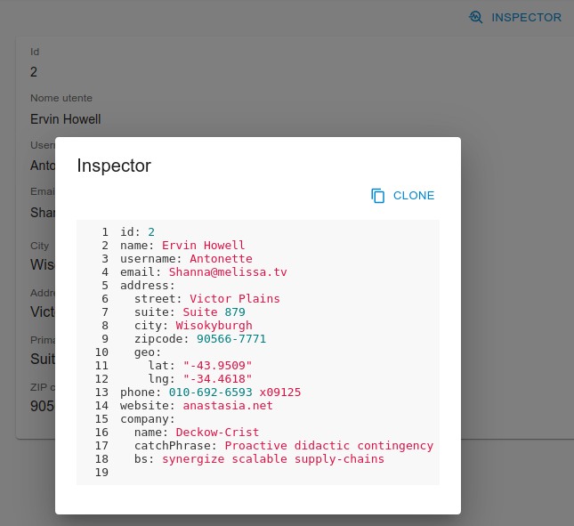

# React-Admin Record Inspector Button

[](https://www.npmjs.com/package/@dslab/ra-inspect-button)
[](https://github.com/smartcommunitylab/react-admin-packages/blob/master/packages/ra-inspect-button/README.md)
[](https://github.com/smartcommunitylab/react-admin-packages/graphs/commit-activity)
[](https://github.com/smartcommunitylab/react-admin-packages/blob/master/LICENSE)

(Record) inspector button for React-Admin: shows the raw representation of a given record in a modal window.
Supports both _json_ and _yaml_ as languages.

## Install

```sh
yarn install @dslab/ra-inspect-button
```

## Usage

To use in a record context (e.g. a list row, a show/edit view ) simply include the button.
For example in a toolbar:

```javascript
import { InspectButton } from '@dslab/ra-inspect-button';

const ShowActions = () => (
    <TopToolbar>
        <InspectButton />
    </TopToolbar>
);
```

In a list:

```javascript
export const PostList = () => (
    <List>
        <Datagrid rowClick="edit">
            <TextField source="id" />
            <TextField source="title" />
            <InspectButton />
        </Datagrid>
    </List>
);
```

Screenshot



### Options

The button and the modal view are fully configurable both in appearance and behavior. Also `SourceCodeBlock` properties are configurable.

```javascript
    /**
    * (Optional) Custom icon for the button
    */
    icon?: ReactElement;
    /**
    * (Optional) record object to use in place of the context
    */
    record?: RecordType;
    /**
    * (Optional) resource identifier to use in place of the context
    */
    resource?: string;
    /**
    * Display the modal window as full-width, filling the viewport. Defaults to `false`
    */
    fullWidth?: boolean;
    /**
    * Max width for the modal window (breakpoint). Defaults to `md`
    */
    maxWidth?: Breakpoint;
```

### Source code block

The packages exports a `SourceCodeBlock` component which can be used outside the inspector to show _source code_ with syntax highlighting. To use import the component and pass the string with the code, optionally tuning the appearance via options.

```javascript
import { SourceCodeBlock } from '@dslab/ra-inspect-button';

<SourceCodeBlock
    code={source}
    language={language}
    theme={theme}
    showLineNumbers={showLineNumbers}
    showCopyButton={showCopyButton}
/>;
```

Options are:

```javascript
    /**
     * Source code as string. Required.
     */
    code: string;
    /**
     * (Optional) language for syntax highlighter
     */
    language?: string;
    /**
     * Theme. Defaults to `dark`
     */
    theme?: 'light' | 'dark';
    /**
     * Show or hide the line numbers. Defaults to `false`
     */
    showLineNumbers?: boolean;
    /**
     * Show or hide the copy button. Default to `true`
     */
    showCopyButton?: boolean;
    /**
     * (Optional) handler for copy button success
     */
    onCopyButtonSuccess?: (e: Event) => void;
```

### Copy to clipboard button

The package also exports the `CopyToClipboardButton` for usage outside the inspector.
The button will copy the _value_ passed to the browser via Clipboard Api.

Usage:

```javascript
import { CopyToClipboardButton } from '@dslab/ra-inspect-button';

const code = 'some source code';

<CopyToClipboardButton value={code} />;
```

The button supports all the standard _ButtonProps_ in addition to the following:

```javascript
    /**
     * Text (string) to be copied
     */
    value: string;
    /**
     * (Optional) Custom icon for the button
     */
    icon?: ReactElement;
    /**
     * (Optional) Custom success icon for the button
     */
    iconSuccess?: ReactElement;
    /**
     * Color. Defaults to `info`
     */
    color?:
        | 'inherit'
        | 'primary'
        | 'secondary'
        | 'success'
        | 'error'
        | 'info'
        | 'warning';
    /**
     * Success color. Defaults to `success`
     */
    colorSuccess?:
        | 'inherit'
        | 'primary'
        | 'secondary'
        | 'success'
        | 'error'
        | 'info'
        | 'warning';
    /**
     * (Optional) handler for success
     */
    onSuccess?: (e: Event) => void;
```

## Author

**SmartCommunityLab**

-   Website: http://www.smartcommunitylab.it/
-   Github: [@smartcommunitylab](https://github.com/smartcommunitylab)

## Show your support

Give a ⭐️ if this project helped you!

## License

Copyright © 2023 [SmartCommunityLab](https://github.com/smartcommunitylab).<br />
This project is [MIT](https://github.com/smartcommunitylab/react-admin-packages/blob/master/LICENSE) licensed.

```

```
