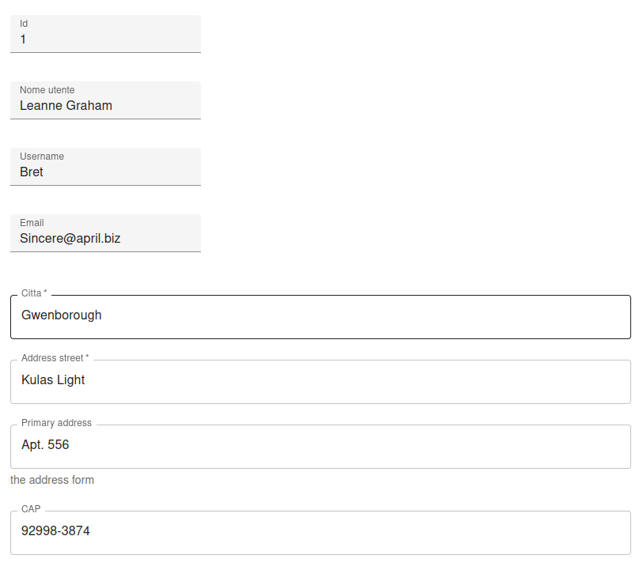
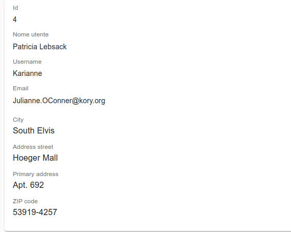

# React-Admin Json Schema Input

[](https://www.npmjs.com/package/@dslab/ra-jsonschema-input)
[](https://github.com/smartcommunitylab/react-admin-packages/blob/master/packages/ra-jsonschema-input/README.md)
[](https://github.com/smartcommunitylab/react-admin-packages/graphs/commit-activity)
[](https://github.com/smartcommunitylab/react-admin-packages/blob/master/LICENSE)

Json schema input field for React-Admin, to render a nested field in the record as nested form with inputs based on a proper _jscon schema_ definition.
Supports validation, required flags and the most common field types. Uses MUIv5 as ui library.

Also supports OOB i18n via react-admin providers and translation messages.

Based on https://github.com/rjsf-team/react-jsonschema-form

## Install

```sh
yarn install @dslab/ra-jsonschema-input
```

## Usage

To use in an edit/create context, where the record is available, include the component as any other input field and declare the _source_ field inside the record.
The _schema_ is required, while _uiSchema_ (for personalization) is optional.

With a record like this (from https://jsonplaceholder.typicode.com/users )

```json
  {
    "id": 1,
    "name": "Leanne Graham",
    "username": "Bret",
    "email": "Sincere@april.biz",
    "address": {
      "street": "Kulas Light",
      "suite": "Apt. 556",
      "city": "Gwenborough",
      "zipcode": "92998-3874",
    },
  },
```

The _edit view_ could be implemented like the following.

```javascript
import { JsonSchemaInput } from '@dslab/ra-jsonschema-input';
import { Edit, SimpleForm, TextInput } from 'react-admin';

const uiSchema = {
    suite: {
        'ui:title': 'Primary address',
        'ui:description': 'the address form',
    },
};
const jsonSchema = {
    type: 'object',
    required: ['street', 'city'],
    properties: {
        city: {
            type: 'string',
        },
        street: {
            type: 'string',
        },
        suite: {
            type: 'string',
        },
        zipcode: {
            type: 'string',
            pattern: '(^\\d{5}$)|(^\\d{5}-\\d{4}$)',
        },
    },
};

export const UserEdit = () => (
    <Edit>
        <SimpleForm>
            <TextInput source="id" />
            <TextInput source="name" />
            <TextInput source="username" />
            <TextInput source="email" />
            <JsonSchemaInput
                schema={jsonSchema}
                uiSchema={uiSchema}
                source="address"
            />
        </SimpleForm>
    </Edit>
);
```

Screenshot for the resulting form



The package also contains a _field_ dedicated to displaying values as read-only, via a customized version of the form.
To use it in a _show_ view include it similarly to the input field.

```javascript
export const UserShow = () => (
    <Show>
        <SimpleShowLayout>
            <TextField source="id" />
            <TextField source="name" />
            <TextField source="username" />
            <TextField source="email" />
            <JsonSchemaField
                schema={jsonSchema}
                uiSchema={uiSchema}
                source="address"
            />
        </SimpleShowLayout>
    </Show>
);
```

Screenshot for the resulting form



#### Additional resources

For customization via uiSchema and detailed documentation follow the guidelines from _react-jsonschema-form_ (https://github.com/rjsf-team/react-jsonschema-form).

## Author

**SmartCommunityLab**

-   Website: http://www.smartcommunitylab.it/
-   Github: [@smartcommunitylab](https://github.com/smartcommunitylab)

## Show your support

Give a ⭐️ if this project helped you!

## License

Copyright © 2023 [SmartCommunityLab](https://github.com/smartcommunitylab).<br />
This project is [MIT](https://github.com/smartcommunitylab/react-admin-packages/blob/master/LICENSE) licensed.
